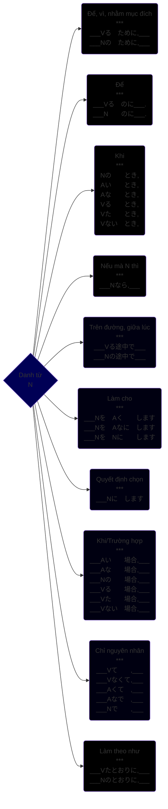

```mermaid
graph LR;
    N{Danh từ\nN}

    N-->nhamMucDich(Để, vì, nhằm mục đích\n***\n___Vる　ために,___\n___Nの　ために,___)
    N-->de(Để\n***\n___Vる　のに___.\n___N　　のに___.)
    N-->khi(Khi\n***\nNの　　とき,\nAい　　とき,\nAな　　とき,\nVる　　とき,\nVた　　とき,\nVない　とき,)
    N-->neuMaNThi(Nếu mà N thì\n***\n___Nなら,___)
    N-->trenDuongGiuaLuc(Trên đường, giữa lúc\n***\n___Vる途中で___\n___Nの途中で___)
    N-->lamCho(Làm cho\n***\n___Nを　Aく　　します\n___Nを　Aなに　します\n___Nを　Nに　　します)
    N-->quyetDinhChon(Quyết định chọn\n***\n___Nに　します)
    N-->truongHop(Khi/Trường hợp\n***\n___Aい　　場合,___\n___Aな　　場合,___\n___Nの　　場合,___\n___Vる　　場合,___\n___Vた　　場合,___\n___Vない　場合,___)
    N-->chiNguyenNhan(Chỉ nguyên nhân\n***\n___Vて　　,___\n___Vなくて,___\n___Aくて　,___\n___Aなで　,___\n___Nで　　,___)
    N-->lamTheoNhu(Làm theo như\n***\n___Vたとおりに,___\n___Nのとおりに,___)

    style N fill:#005
    style chiNguyenNhan fill:#001
    style de fill:#000
    style khi fill:#000
    style lamCho fill:#001
    style lamTheoNhu fill:#000
    style neuMaNThi fill:#000
    style nhamMucDich fill:#000
    style quyetDinhChon fill:#001
    style trenDuongGiuaLuc fill:#001
    style truongHop fill:#001
```