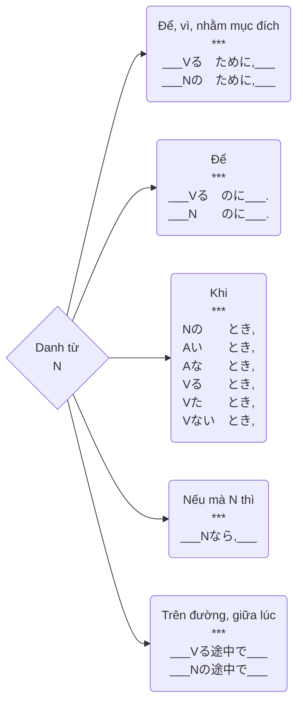

```mermaid
graph LR;
    N{Danh từ\nN}

    N-->nhamMucDich(Để, vì, nhằm mục đích\n***\n___Vる　ために,___\n___Nの　ために,___)
    N-->de(Để\n***\n___Vる　のに___.\n___N　　のに___.)
    N-->khi(Khi\n***\nNの　　とき,\nAい　　とき,\nAな　　とき,\nVる　　とき,\nVた　　とき,\nVない　とき,)
    N-->neuMaNThi(Nếu mà N thì\n***\n___Nなら,___)
    N-->trenDuongGiuaLuc(Trên đường, giữa lúc\n***\n___Vる途中で___\n___Nの途中で___)
```