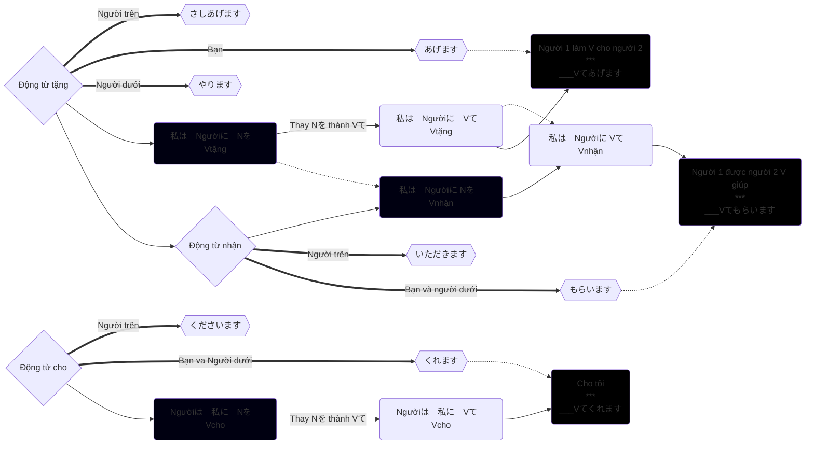

```mermaid
graph LR;
	Vt{Động từ tặng}
	Vc{Động từ cho}

	Vt==>|Người trên|bieuT{{さしあげます}}
	Vt==>|Bạn|tangT{{あげます}}
	Vt==>|Người dưới|choT{{やります}}

	Vc==>|Người trên|bieuN{{くださいます}}
	Vc==>|Bạn va Người dưới|tangN{{くれます}}

	Vt-->npTang(私は　Ngườiに　Nを　Vtặng)
	npTang-->|Thay Nを thành Vて|npTangVte(私は　Ngườiに　Vて　Vtặng)

	Vc-->npCho(Ngườiは　私に　Nを　Vcho)
	npCho-->|Thay Nを thành Vて|npChoVte(Ngườiは　私に　Vて　Vcho)

	Vt-->Vn{Động từ nhận}
	npTang-.->npNhan(私は　Ngườiに Nを　Vnhận)
	Vn-->npNhan-->npNhanVte(私は　Ngườiに Vて　Vnhận)
	npTangVte-.->npNhanVte(私は　Ngườiに Vて　Vnhận)
	Vn==>|Người trên|nhan{{いただきます}}
	Vn==>|Bạn và người dưới|nhan2{{もらいます}}

	npChoVte-->choToi(Cho tôi\n***\n___Vてくれます)
	tangN-.->choToi

	npNhanVte-->N1DuocN2VGiup(Người 1 được người 2 V giúp\n***\n___Vてもらいます)
	nhan2-.->N1DuocN2VGiup

	npTangVte-->N1LamVChoN2(Người 1 làm V cho người 2\n***\n___Vてあげます)
	tangT-.->N1LamVChoN2

	style npCho fill:#001
	style npTang fill:#001
	style npNhan fill:#001
	style choToi fill:#000
	style N1DuocN2VGiup fill:#000
	style N1LamVChoN2 fill:#000
```
