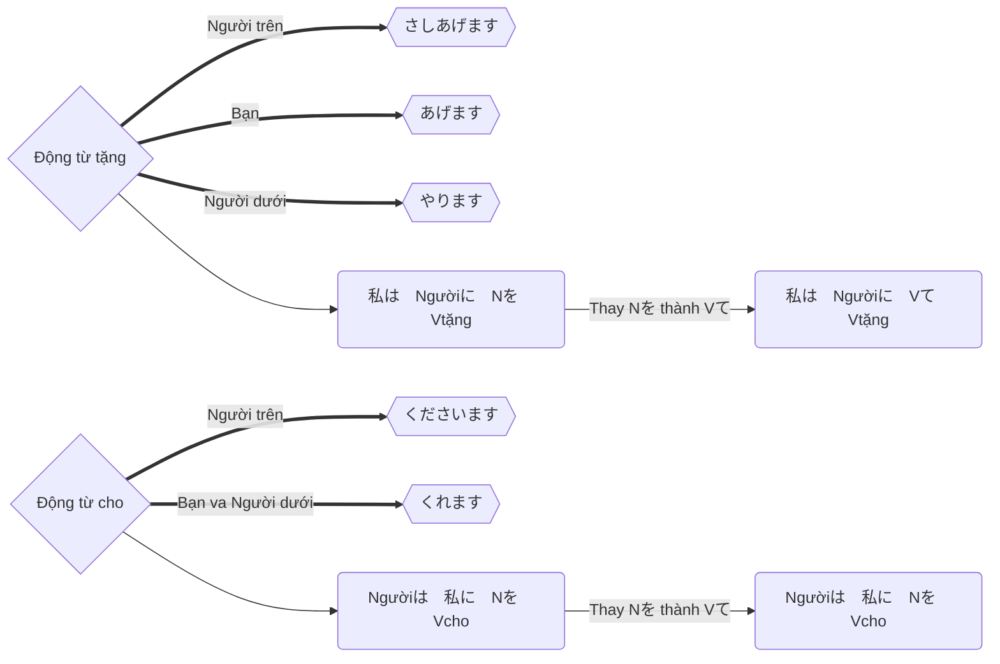

```mermaid
graph LR;
  Vt{Động từ tặng}
  Vc{Động từ cho}

  Vt==>|Người trên|bieuT{{さしあげます}}
  Vt==>|Bạn|tangT{{あげます}}
  Vt==>|Người dưới|choT{{やります}}

  Vc==>|Người trên|bieuN{{くださいます}}
  Vc==>|Bạn va Người dưới|tangN{{くれます}}

  Vt-->npTang(私は　Ngườiに　Nを　Vtặng)
  npTang-->|Thay Nを thành Vて|npTangVte(私は　Ngườiに　Vて　Vtặng)

  Vc-->npCho(Ngườiは　私に　Nを　Vcho)
  npCho-->|Thay Nを thành Vて|npChoVte(Ngườiは　私に　Nを　Vcho)
```
