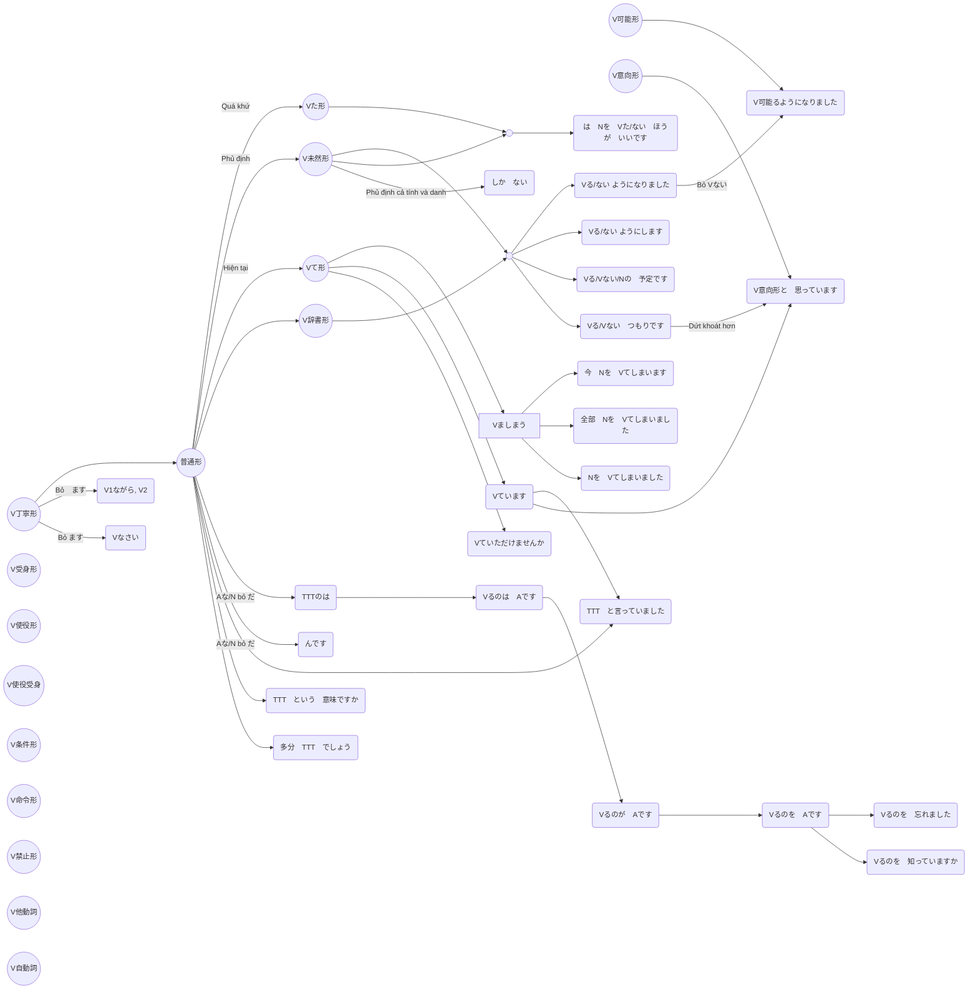

```mermaid
graph LR;
    Vmasu((V丁寧形))
    Vru((V辞書形))
    Vta((Vた形))
    Vnai((V未然形))
    Vte((Vて形))
    Vkn((V可能形))
    Vbd((V受身形))
    Vsk((V使役形))
    Vskbd((V使役受身))
    Vdk((V条件形))
    Vml((V命令形))
    Vyc((V意向形))
    Vcc((V禁止形))
    Vtha((V他動詞))
    Vtu((V自動詞))

    TTT((普通形))
    Vmasu--->TTT-->|Quá khứ|Vta
    TTT-->|Phủ định|Vnai
    TTT-->|Hiện tại|Vte
    TTT-->Vru
    
    CT(Vる/ない ようになりました)
    Vru-->Vru_nai(( ))
    Vnai-->Vru_nai
    Vru_nai-->CT
    
    coGangSaoCho(Vる/ない ようにします)
    Vru_nai-->coGangSaoCho

    Vte-->Vましまう

    Vましまう-->A0(今　Nを　Vてしまいます)
    Vましまう-->A1(全部　Nを　Vてしまいました)
    Vましまう-->A2(Nを　Vてしまいました)
    
    TTT-->|Aな/N bỏ だ|danhTuHoa(TTTのは)

    daCoThe(V可能るようになりました)
    Vkn-->daCoThe
    CT-->|Bỏ Vない|daCoThe

    viecVThiA(Vるのは　Aです)-->viecVThiA2(Vるのが　Aです)-->viecVThiA3(Vるのを　Aです)
    danhTuHoa-->viecVThiA

    vuaVua(V1ながら, V2)
    Vmasu-->|Bỏ　ます|vuaVua

    ndesu(んです)
    TTT-->|Aな/N bỏ だ|ndesu

    nenKhongNen(は　Nを　Vた/ない　ほうが　いいです)
    Vta-->T2(( ))
    Vnai-->T2
    T2-->nenKhongNen

    dangLamV(Vています)
    Vte-->dangLamV

    noiRang(TTT　と言っていました)
    TTT-->noiRang
    dangLamV-->noiRang

    daQuenV(Vるのを　忘れました)
    viecVThiA3-->daQuenV

    menhLenhNhe(Vなさい)
    Vmasu-->|Bỏ ます|menhLenhNhe

    coTheLamVGiupToiKhong(Vていただけませんか)
    Vte-->coTheLamVGiupToiKhong

    nghiaLa(TTT　という　意味ですか)
    TTT-->nghiaLa

    keHoachDuDinh(Vる/Vない/Nの　予定です)
    Vru_nai-->keHoachDuDinh

    dinh(V意向形と　思っています)
    Vyc-->dinh
    dangLamV-->dinh

    duDinh(Vる/Vない　つもりです)
    Vru_nai-->duDinh
    duDinh-->|Dứt khoát hơn|dinh

    chiChiCo(しか　ない)
    Vnai-->|Phủ định cả tính và danh|chiChiCo

    coLeChacLa(多分　TTT　でしょう)
    TTT-->coLeChacLa

    coBietVKhong(Vるのを　知っていますか)
    viecVThiA3-->coBietVKhong
```