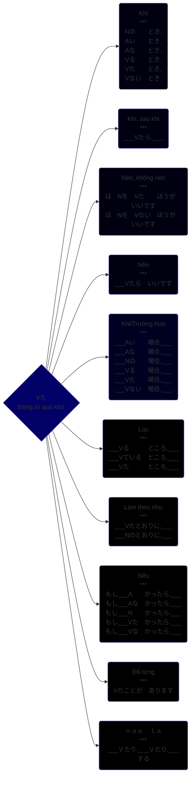

```mermaid
graph LR;
    V{Vた\nĐộng từ quá khứ}

    V-->khi(Khi\n***\nNの　　とき,\nAい　　とき,\nAな　　とき,\nVる　　とき,\nVた　　とき,\nVない　とき,)
    V-->khiSauKhi(Khi, sau khi\n***\n___Vたら,___)
    V-->nenKhongNen(Nên, không nên\n***\nは　Nを　Vた　　ほうが　いいです\nは　Nを　Vない　ほうが　いいです)
    V-->nenV(Nên\n***\n___Vたら　いいです)
    V-->truongHop(Khi/Trường hợp\n***\n___Aい　　場合,___\n___Aな　　場合,___\n___Nの　　場合,___\n___Vる　　場合,___\n___Vた　　場合,___\n___Vない　場合,___)
    V-->luc(Lúc\n***\n___Vる　　　ところ,___\n___Vている　ところ,___\n___Vた　　　ところ,___)
    V-->lamTheoNhu(Làm theo như\n***\n___Vたとおりに,___\n___Nのとおりに,___)
    V-->neu(Nếu\n***\nもし___A　　かったら,___\nもし___Aな　かったら,___\nもし___N　　かったら,___\nもし___Vた　かったら,___\nもし___Vな　かったら,___)
    V-->daTung(Đã từng\n***\nVたことが　あります)
    V-->naoLa(ｎａｏ　ｌａ\n***\n___Ｖたり,___Ｖたり,___する)

    style V fill:#006
    style daTung fill:#000
    style khi fill:#001
    style khiSauKhi fill:#001
    style lamTheoNhu fill:#000
    style luc fill:#000
    style naoLa fill:#000
    style nenKhongNen fill:#001
    style nenV fill:#001
    style neu fill:#000
    style truongHop fill:#002
```