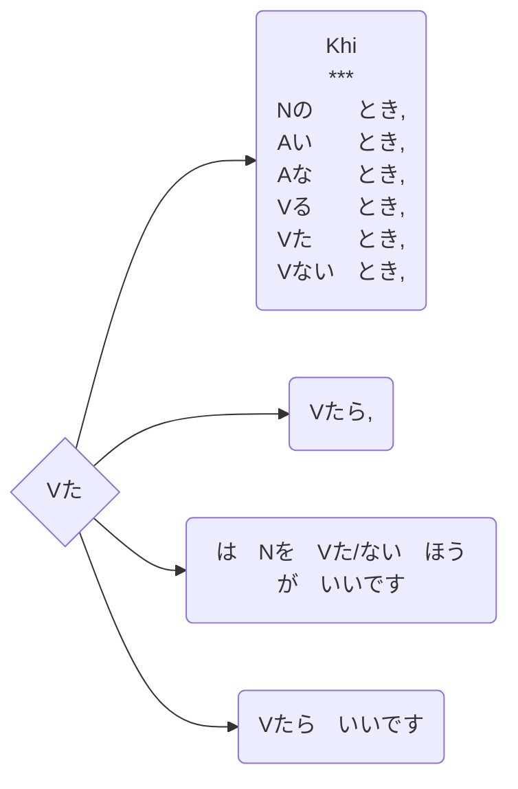

```mermaid
graph LR;
    V{Vた}

    V-->khi(Khi\n***\nNの　　とき,\nAい　　とき,\nAな　　とき,\nVる　　とき,\nVた　　とき,\nVない　とき,)
    V-->khiSauKhi(Vたら,)
    V-->nenKhongNen(は　Nを　Vた/ない　ほうが　いいです)
    V-->nenV(Vたら　いいです)
```