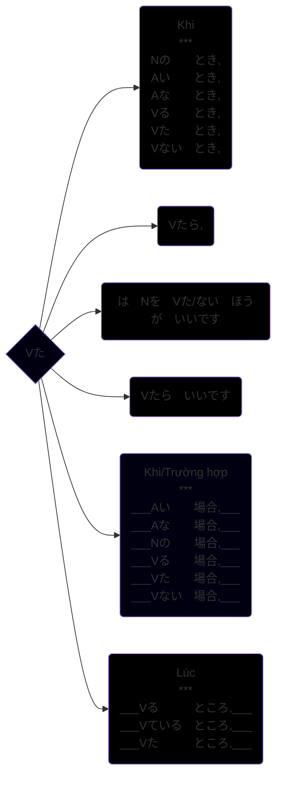

```mermaid
graph LR;
    V{Vた}

    V-->khi(Khi\n***\nNの　　とき,\nAい　　とき,\nAな　　とき,\nVる　　とき,\nVた　　とき,\nVない　とき,)
    V-->khiSauKhi(Vたら,)
    V-->nenKhongNen(は　Nを　Vた/ない　ほうが　いいです)
    V-->nenV(Vたら　いいです)
    V-->truongHop(Khi/Trường hợp\n***\n___Aい　　場合,___\n___Aな　　場合,___\n___Nの　　場合,___\n___Vる　　場合,___\n___Vた　　場合,___\n___Vない　場合,___)
    V-->luc(Lúc\n***\n___Vる　　　ところ,___\n___Vている　ところ,___\n___Vた　　　ところ,___)

    style V fill:#001
    style khi fill:#000
    style khiSauKhi fill:#000
    style luc fill:#000
    style nenKhongNen fill:#000
    style nenV fill:#000
    style truongHop fill:#001
```