>Thể 「て」là dạng của động từ có đuôi là 「て」hoặc「で」。Đây là thể được sử dụng rất nhiều trong các cấu trúc cũng như văn phạm của tiếng nhật nên có thể coi đây là 1 thể rất quan trọng khi học tiếng Nhật.

```mermaid
graph LR;
    V{Thể te\nて形\nVて}

    V-->hayLamV(Hãy làm V\n***\n___Vてください)
    hayLamV-->lamOn(Làm ơn làm V\n***\n___Vてくれませんか)
    lamOn-->coThemLamVGiupToiDuocKhong1(Có thể làm V dùm tôi được không\n***\n___Vてくださいませんか)
    coThemLamVGiupToiDuocKhong1-->coThemLamVGiupToiDuocKhong2(Có thể làm V dùm tôi được không\n***\n___Vていただけませんか)
    V-->thuLamV(Thử làm V\n***\n___は　Nを　Vてみます)
    V-->chiNguyenNhan(Chỉ nguyên nhân\n***\n___Vて　　,___\n___Vなくて,___\n___Aくて　,___\n___Aなで　,___\n___Nで　　,___)
    V-->diRoiQuayLai(Đi rồi quay lại\n***\n___Vて来ます)
    V-->simau(___Vてしまう)
    simau-->dinhSeLamXong(Định sẽ làm xong\n***\n___今　Nを　Vてしまいます.)
    simau-->daLamXong(Đã làm xong\n***\n___全部　Nを　Vてしまいました.)
    daLamXong-->daXayRa(Đã xảy ra tiếc\n***\n___Nを　Vてしまいました.)
    V-->oku(Vておく)
    oku-->chuanBiSan(Chuẩn bị sẵn\n***\n__前に___Vておきます.)
    oku-->giaiPhapTamThoi(Giải pháp tạm thời\n***\n__たら,___Vておきます.)
    oku-->giuNguyenDuyTriTrangThai(Giữ nguyên, duy trì trạng thái\n***\n__そのまま,___Vておきます.)
    V-->luc(Lúc\n***\n___Vる　　　ところ,___\n___Vている　ところ,___\n___Vた　　　ところ,___)

    style V fill:#003
    style chiNguyenNhan fill:#001
    style chuanBiSan fill:#000
    style coThemLamVGiupToiDuocKhong1 fill:#000
    style coThemLamVGiupToiDuocKhong2 fill:#000
    style daLamXong fill:#000
    style daXayRa fill:#000
    style dinhSeLamXong fill:#000
    style diRoiQuayLai fill:#000
    style giaiPhapTamThoi fill:#000
    style giuNguyenDuyTriTrangThai fill:#000
    style hayLamV fill:#000
    style lamOn fill:#001
    style thuLamV fill:#001
    style luc fill:#000
```
