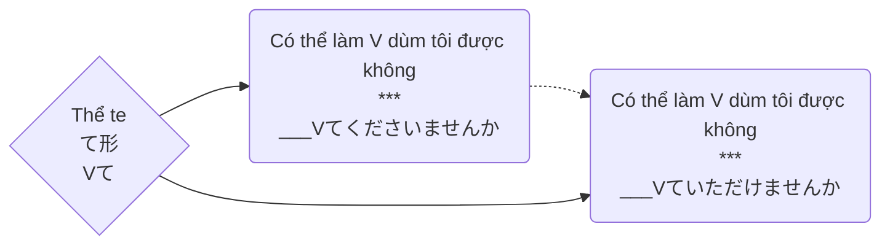

```mermaid
graph LR;
    Vte{Thể te\nて形\nVて}

    Vte-->coThemLamVGiupToiDuocKhong1(Có thể làm V dùm tôi được không\n***\n___Vてくださいませんか)
    coThemLamVGiupToiDuocKhong1-.->coThemLamVGiupToiDuocKhong2
    Vte-->coThemLamVGiupToiDuocKhong2(Có thể làm V dùm tôi được không\n***\n___Vていただけませんか)
    
```