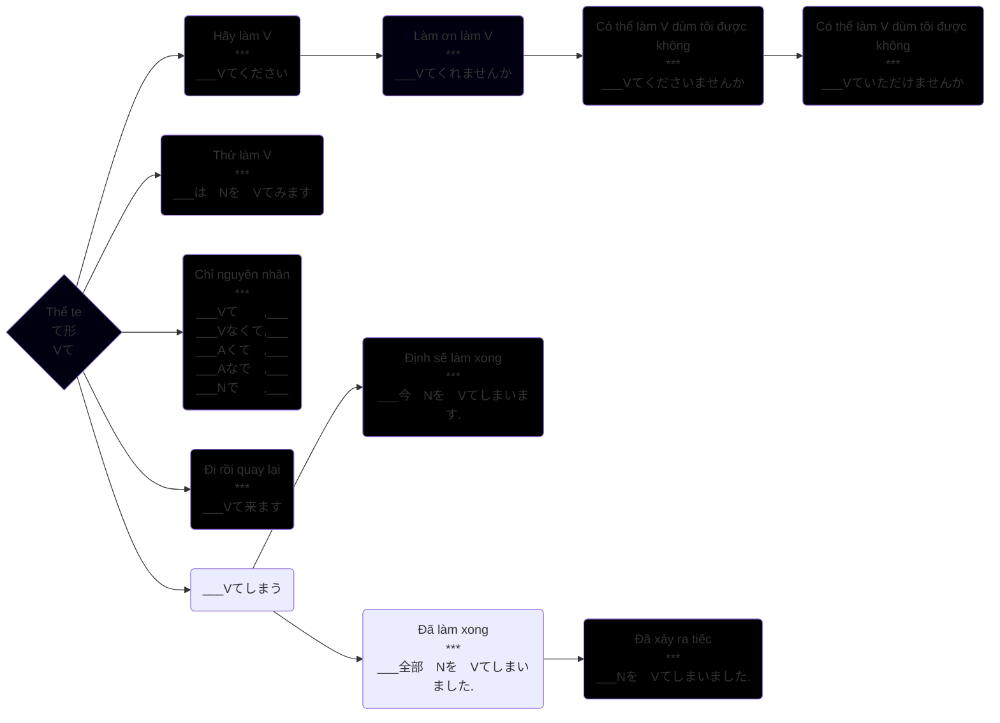

```mermaid
graph LR;
    V{Thể te\nて形\nVて}

    V-->hayLamV(Hãy làm V\n***\n___Vてください)
    hayLamV-->lamOn(Làm ơn làm V\n***\n___Vてくれませんか)
    lamOn-->coThemLamVGiupToiDuocKhong1(Có thể làm V dùm tôi được không\n***\n___Vてくださいませんか)
    coThemLamVGiupToiDuocKhong1-->coThemLamVGiupToiDuocKhong2(Có thể làm V dùm tôi được không\n***\n___Vていただけませんか)
    V-->thuLamV(Thử làm V\n***\n___は　Nを　Vてみます)
    V-->chiNguyenNhan(Chỉ nguyên nhân\n***\n___Vて　　,___\n___Vなくて,___\n___Aくて　,___\n___Aなで　,___\n___Nで　　,___)
    V-->diRoiQuayLai(Đi rồi quay lại\n***\n___Vて来ます)
    V-->simau(___Vてしまう)
    simau-->dinhSeLamXong(Định sẽ làm xong\n***\n___今　Nを　Vてしまいます.)
    simau-->daLamXong(Đã làm xong\n***\n___全部　Nを　Vてしまいました.)
    daLamXong-->daXayRa(Đã xảy ra tiếc\n***\n___Nを　Vてしまいました.)

    style V fill:#001
    style hayLamV fill:#000
    style lamOn fill:#001
    style coThemLamVGiupToiDuocKhong1 fill:#000
    style coThemLamVGiupToiDuocKhong2 fill:#000
    style thuLamV fill:#000
    style chiNguyenNhan fill:#000
    style diRoiQuayLai fill:#000
    style dinhSeLamXong fill:#000
    style daXayRa fill:#000
```