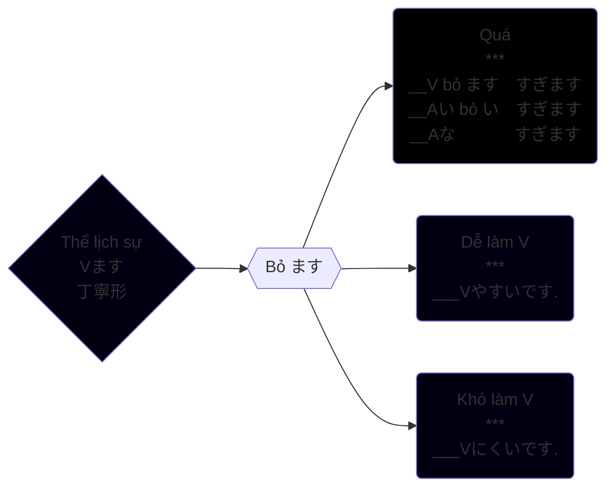

>Thể lịch sự được sử dụng khi nói chuyện với người mới quen hoặc cấp trên, người hơn tuổi, dùng để thể hiện sự tôn trọng khi nói chuyện với đối phương.

```mermaid
graph LR;
    V{Thể lịch sự\nVます\n丁寧形}

    V-->boMasu{{Bỏ ます}}
    boMasu-->qua(Quá\n***\n__V bỏ ます　すぎます\n__Aい bỏ い　すぎます\n__Aな 　　 　すぎます)
    boMasu-->deLamV(Dễ làm V\n***\n___Vやすいです.)
    boMasu-->khoLamV(Khó làm V\n***\n___Vにくいです.)

    style V fill:#001
    style qua fill:#000
    style deLamV fill:#001
    style khoLamV fill:#001
```