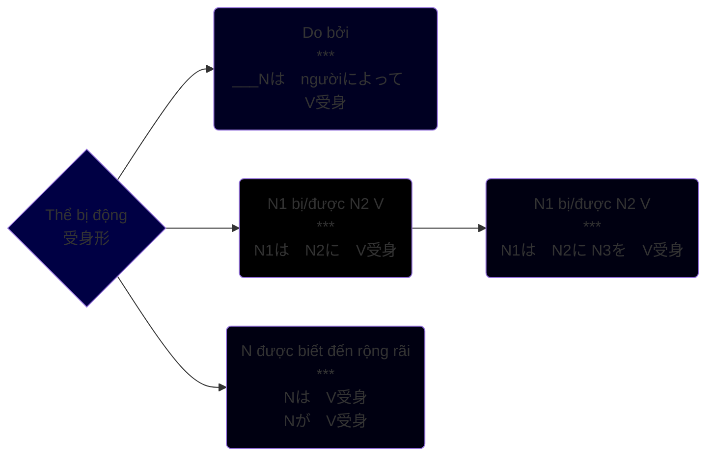

>Thể bị động trong tiếng nhật thường Dùng để diễn tả ý tình trạng bị động. Đôi khi có được diễn tả tình trạng “được” ai đó làm gì cho mình. Thường được dịch là Bị – Được.

```mermaid
graph LR;
    V{Thể bị động\n受身形}

    V-->doBoi(Do bởi\n***\n___Nは　ngườiによって　V受身)
    V-->N1BiDuocN2V(N1 bị/được N2 V\n***\nN1は　N2に　V受身)
    N1BiDuocN2V-->N1BiDuocN2V2(N1 bị/được N2 V\n***\nN1は　N2に N3を　V受身)
    V-->bietDenRongRai(N được biết đến rộng rãi\n***\nNは　V受身\nNが　V受身)


    style V fill:#004
    style doBoi fill:#002
    style N1BiDuocN2V fill:#000
    style N1BiDuocN2V2 fill:#001
    style bietDenRongRai fill:#001
```