>Động từ thể ý chí, trong tiếng Nhật gọi là 意思形 (いしけい). Ở trình độ N5 chúng ta đã học thể ～ましょう, đây chính là dạng lịch sự của thể ý chí mà chúng ta sẽ học trong bài này. Gọi là thể ý chí vì nó diễn đạt ý chí muốn làm gì đó, muốn mời mọc, rủ rê, hay đề xuất một việc gì đó.

```mermaid
graph LR;
    V{いしけい\nV意向形\n Thể ý định}
    V-->dinh(Định\n***\n___は　Nを　V意向形と　思っています)

    style V fill:#000
    style dinh fill:#000
```
