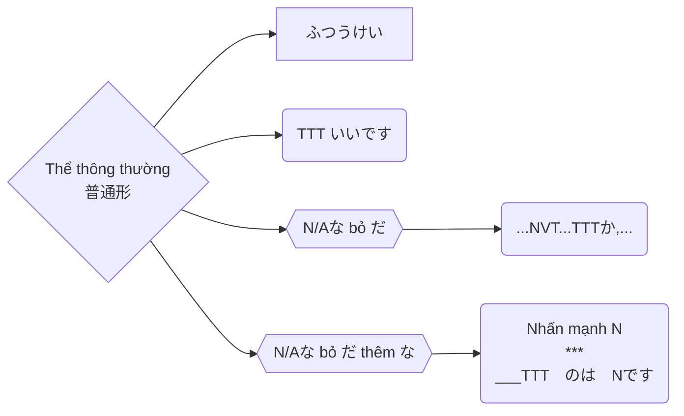

```mermaid
graph LR;
    TTT{Thể thông thường\n普通形}-->ふつうけい
    TTT-->nen(TTT いいです)
    TTT-->boDa{{N/Aな bỏ だ}}
    boDa-->longCauNghiVan(...NVT...TTTか,...)
    TTT-->boDaThemNa{{N/Aな bỏ だ thêm な}}
    boDaThemNa-->nhanManhN(Nhấn mạnh N\n***\n___TTT　のは　Nです)
```
