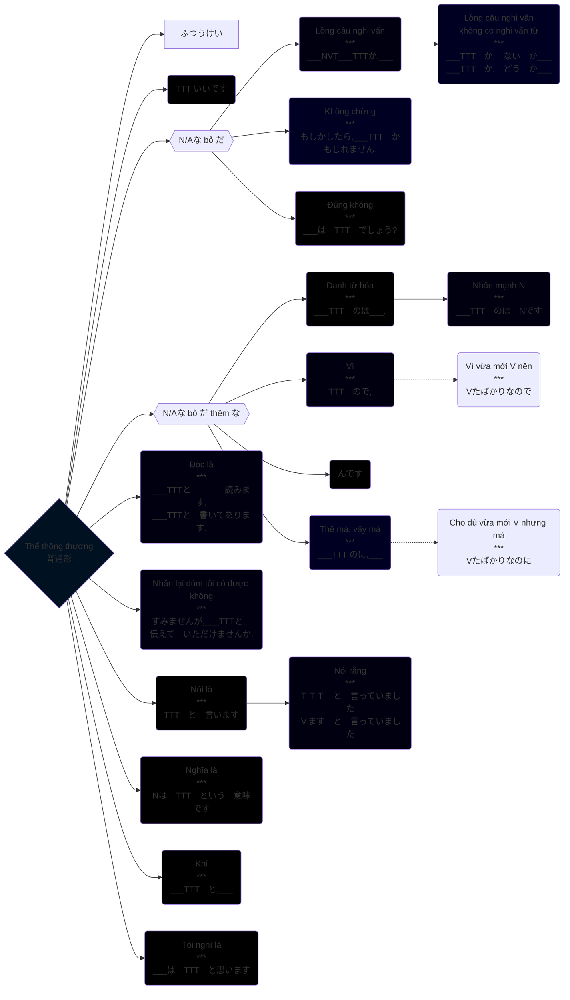

```mermaid
graph LR;
    TTT{Thể thông thường\n普通形}-->ふつうけい
    TTT-->nen(TTT いいです)
    TTT-->boDa{{N/Aな bỏ だ}}
    boDa-->longCauNghiVan(Lồng câu nghi vấn\n***\n___NVT___TTTか,___)
    longCauNghiVan-->longCauNghiVan2(Lồng câu nghi vấn\n không có nghi vấn từ\n***\n___TTT　か,　ない　か___\n___TTT　か,　どう　か___)
    boDa-->khongChung(Không chừng\n***\nもしかしたら,___TTT　かもしれません.)
    TTT-->boDaThemNa{{N/Aな bỏ だ thêm な}}
    boDaThemNa-->danhTuHoa(Danh từ hóa\n***\n___TTT　のは___.)
    danhTuHoa-->nhanManhN(Nhấn mạnh N\n***\n___TTT　のは　Nです)
    boDaThemNa-->vi(Vì\n***\n___TTT　ので,___)
    TTT-->docLaVietLa(Đọc là\n***\n___TTTと　　　　読みます.\n___TTTと　書いてあります.)
    boDaThemNa-->ndesu(んです)
    boDaThemNa-->theMaVayMa(Thế mà, vậy mà\n***\n___TTT のに,___)
    TTT-->nhanLaiDumToi(Nhắn lại dùm tôi có được không\n***\nすみませんが,___TTTと　伝えて　いただけませんか.)
    TTT-->noiLa(Nói là\n***\nTTT　と　言います)
    noiLa-->noiRang(Nói rằng\n***\nＴＴＴ　と　言っていました\nＶます　と　言っていました)
    TTT-->nghiaLa(Nghĩa là\n***\nNは　TTT　という　意味です)
    boDa-->dungKhong(Đúng không\n***\n___は　TTT　でしょう?)
    TTT-->khi(Khi\n***\n___TTT　と,___)
    TTT-->toiNghiLa(Tôi nghĩ là\n***\n___は　TTT　と思います)
    vi-.->viVuaMoiVNen(Vì vừa mới V nên\n***\nVたばかりなので)
    theMaVayMa-.->choDuVuaMoiVNhungMa(Cho dù vừa mới V nhưng mà\n***\nVたばかりなのに)

    style TTT fill:#012
    style danhTuHoa fill:#000
    style docLaVietLa fill:#001
    style dungKhong fill:#000
    style khi fill:#000
    style khongChung fill:#002
    style longCauNghiVan fill:#001
    style longCauNghiVan2 fill:#002
    style ndesu fill:#000
    style nen fill:#000
    style nghiaLa fill:#000
    style nhanLaiDumToi fill:#001
    style nhanManhN fill:#001
    style noiLa fill:#000
    style noiRang fill:#001
    style theMaVayMa fill:#002
    style toiNghiLa fill:#000
    style vi fill:#001
```
