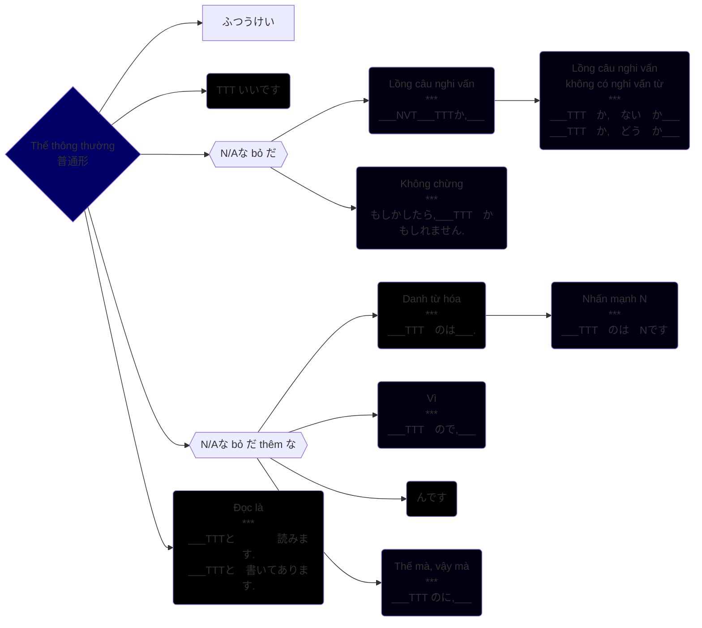

```mermaid
graph LR;
    TTT{Thể thông thường\n普通形}-->ふつうけい
    TTT-->nen(TTT いいです)
    TTT-->boDa{{N/Aな bỏ だ}}
    boDa-->longCauNghiVan(Lồng câu nghi vấn\n***\n___NVT___TTTか,___)
    longCauNghiVan-->longCauNghiVan2(Lồng câu nghi vấn\n không có nghi vấn từ\n***\n___TTT　か,　ない　か___\n___TTT　か,　どう　か___)
    boDa-->khongChung(Không chừng\n***\nもしかしたら,___TTT　かもしれません.)
    TTT-->boDaThemNa{{N/Aな bỏ だ thêm な}}
    boDaThemNa-->danhTuHoa(Danh từ hóa\n***\n___TTT　のは___.)
    danhTuHoa-->nhanManhN(Nhấn mạnh N\n***\n___TTT　のは　Nです)
    boDaThemNa-->vi(Vì\n***\n___TTT　ので,___)
    TTT-->docLaVietLa(Đọc là\n***\n___TTTと　　　　読みます.\n___TTTと　書いてあります.)
    boDaThemNa-->ndesu(んです)
    boDaThemNa-->theMaVayMa(Thế mà, vậy mà\n***\n___TTT のに,___)

    style TTT fill:#006
    style danhTuHoa fill:#000
    style docLaVietLa fill:#000
    style khongChung fill:#001
    style longCauNghiVan fill:#001
    style longCauNghiVan2 fill:#001
    style ndesu fill:#000
    style nen fill:#000
    style nhanManhN fill:#001
    style theMaVayMa fill:#001
    style vi fill:#001
```
