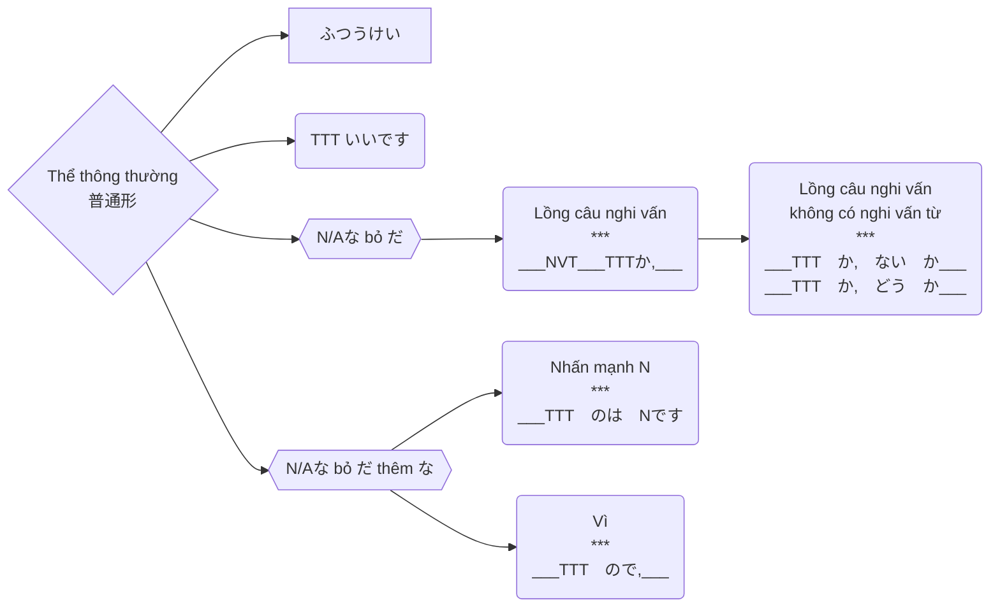

```mermaid
graph LR;
    TTT{Thể thông thường\n普通形}-->ふつうけい
    TTT-->nen(TTT いいです)
    TTT-->boDa{{N/Aな bỏ だ}}
    boDa-->longCauNghiVan(Lồng câu nghi vấn\n***\n___NVT___TTTか,___)
    -->longCauNghiVan2(Lồng câu nghi vấn\n không có nghi vấn từ\n***\n___TTT　か,　ない　か___\n___TTT　か,　どう　か___)
    TTT-->boDaThemNa{{N/Aな bỏ だ thêm な}}
    boDaThemNa-->nhanManhN(Nhấn mạnh N\n***\n___TTT　のは　Nです)
    boDaThemNa-->vi(Vì\n***\n___TTT　ので,___)
```
