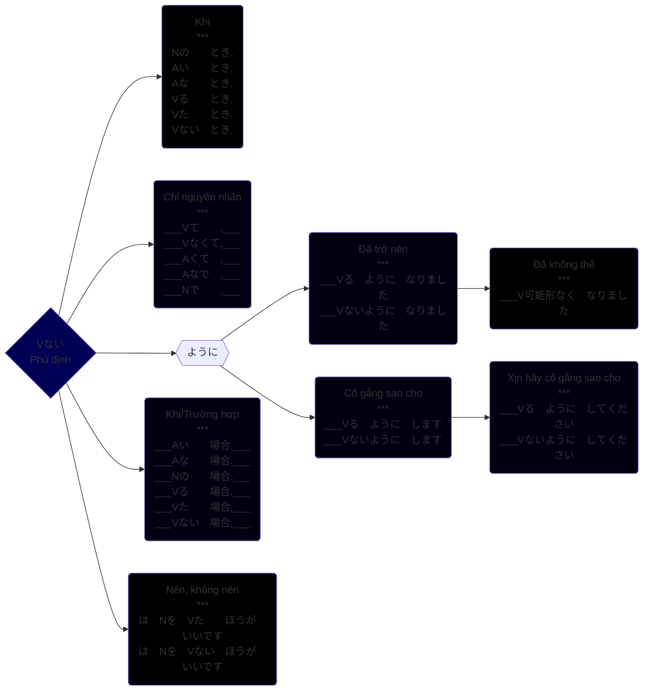

```mermaid
graph LR;
    V{Vない\n Phủ định}

    V-->khi(Khi\n***\nNの　　とき,\nAい　　とき,\nAな　　とき,\nVる　　とき,\nVた　　とき,\nVない　とき,)
    V-->chiNguyenNhan(Chỉ nguyên nhân\n***\n___Vて　　,___\n___Vなくて,___\n___Aくて　,___\n___Aなで　,___\n___Nで　　,___)
    V-->youni{{ように}}
    youni-->daTroNen(Đã trở nên\n***\n___Vる　ように　なりました\n___Vないように　なりました)
    youni-->coGangSaoCho(Cố gắng sao cho\n***\n___Vる　ように　します\n___Vないように　します)
    coGangSaoCho-->xinHayCoGangSaoCho(Xin hãy cố gắng sao cho\n***\n___Vる　ように　してください\n___Vないように　してください)
    daTroNen-->daKhongThe(Đã không thể\n***\n___V可能形なく　なりました)
    V-->truongHop(Khi/Trường hợp\n***\n___Aい　　場合,___\n___Aな　　場合,___\n___Nの　　場合,___\n___Vる　　場合,___\n___Vた　　場合,___\n___Vない　場合,___)
    V-->nenKhongNen(Nên, không nên\n***\nは　Nを　Vた　　ほうが　いいです\nは　Nを　Vない　ほうが　いいです)

    style V fill:#005
    style chiNguyenNhan fill:#001
    style coGangSaoCho fill:#001
    style daKhongThe fill:#000
    style daTroNen fill:#001
    style khi fill:#000
    style truongHop fill:#001
    style xinHayCoGangSaoCho fill:#001
    style nenKhongNen fill:#000
```