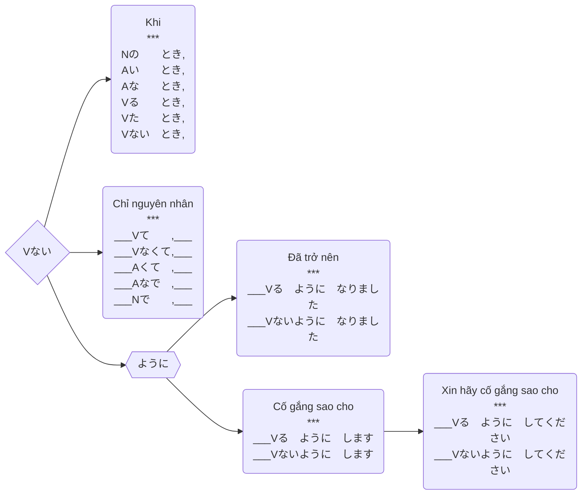

```mermaid
graph LR;
    V{Vない}

    V-->khi(Khi\n***\nNの　　とき,\nAい　　とき,\nAな　　とき,\nVる　　とき,\nVた　　とき,\nVない　とき,)
    V-->chiNguyenNhan(Chỉ nguyên nhân\n***\n___Vて　　,___\n___Vなくて,___\n___Aくて　,___\n___Aなで　,___\n___Nで　　,___)
    V-->youni{{ように}}
    youni-->daTroNen(Đã trở nên\n***\n___Vる　ように　なりました\n___Vないように　なりました)
    youni-->coGangSaoCho(Cố gắng sao cho\n***\n___Vる　ように　します\n___Vないように　します)
    coGangSaoCho-->xinHayCoGangSaoCho(Xin hãy cố gắng sao cho\n***\n___Vる　ように　してください\n___Vないように　してください)
```