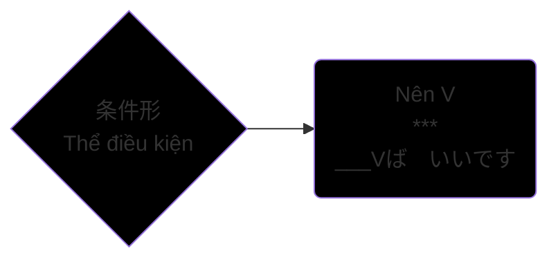

>Thể điều kiện dùng để nêu lên một giả thiết về một sự việc, mà sự việc đó chỉ có thể xảy ra khi điều kiện được nói đến xảy ra. 

```mermaid
graph LR;
    V{条件形\n Thể điều kiện}

    V-->nenV(Nên V\n***\n___Vば　いいです)

    style V fill:#000
    style nenV fill:#000
```