>Thể từ điển 辞書形　（じしょけい）　hay còn gọi là thể nguyên mẫu là thể cơ bản (động từ gốc) của động từ, trong sách từ điển các động từ được trình bày ở thể thể từ điển, vì vậy muốn tra được từ điển thì các bạn cần phải biết về thể từ điển hơn thế nữa động từ thể Vる (thể từ điển) thì cũng được sử dụng nhiều hơn trong hội thoại hàng ngày.

```mermaid
graph LR;
    V{Thể từ điển\n辞書形\nVる}

    V-->khi(Khi\n***\nNの　　とき,\nAい　　とき,\nAな　　とき,\nVる　　とき,\nVた　　とき,\nVない　とき,)
    V-->nhamMucDich(Để, vì, nhằm mục đích\n***\n___Vる　ために,___\n___Nの　ために,___)
    V-->danhTuHoa(Danh từ hóa\n***\nVるの)
    danhTuHoa-->viecVthiAGa(Việc V thì A\n***\nVるのが　Aです)
    danhTuHoa-->coBietVKhong(Có biết V không\n***\nVるのを　知っていますか)
    danhTuHoa-->daQuenV(Đã quên V\n***\nVるのを　忘れました)
    danhTuHoa-->de(Để\n***\n___Vる　のに___.\n___N　　のに___.)
    danhTuHoa-->viecVThiAHa(Việc V thì A\n***\n___Vるのは　Aです.)
    V-->youni{{ように}}
    youni-->daTroNen(Đã trở nên\n***\n___Vる　ように　なりました\n___Vないように　なりました)
    daTroNen-->daCoThe(Đã có thể\n***\n___V可能形る　ように　なりました)
    V-->trenDuongGiuaLuc(Trên đường, giữa lúc\n***\n___Vる途中で___\n___Nの途中で___)
    youni-->coGangSaoCho(Cố gắng sao cho\n***\n___Vる　ように　します\n___Vないように　します)
    coGangSaoCho-->xinHayCoGangSaoCho(Xin hãy cố gắng sao cho\n***\n___Vる　ように　してください\n___Vないように　してください)
    V-->truongHop(Khi/Trường hợp\n***\n___Aい　　場合,___\n___Aな　　場合,___\n___Nの　　場合,___\n___Vる　　場合,___\n___Vた　　場合,___\n___Vない　場合,___)
    V-->luc(Lúc\n***\n___Vる　　　ところ,___\n___Vている　ところ,___\n___Vた　　　ところ,___)
    luc-->sapSua(Sắp sửa\n***\nこれから,___Vるところです\nちょうど,___Vるところです\nいまから,___Vるところです)
    V-->dinh(Định\n***\n___は　Nを　　Vるつもりです.\n___は　Nを　Vないつもりです.)
    V-->truocKhi(Trước khi\n***\n___は　ｖる　まえに,　ｖ\n___は　ｎの　まえに,　ｖ\n___は　ｔｇ　まえに,　ｖ)
    V-->coThe(Có thề\n***\n)
    V-->chacChanLa(Chắc chắn là\n***\n___Ａい　はずです\n___Ａな　はずです\n___Ｎの　はずです\n___Ｖる　はずです\n___Ｖないはずです)

    style V fill:#025
    style chacChanLa fill:#001
    style coBietVKhong fill:#001
    style coGangSaoCho fill:#002
    style daCoThe fill:#002
    style daQuenV fill:#000
    style daTroNen fill:#002
    style de fill:#002
    style dinh fill:#000
    style khi fill:#001
    style luc fill:#002
    style nhamMucDich fill:#002
    style sapSua fill:#002
    style trenDuongGiuaLuc fill:#001
    style truocKhi fill:#000
    style truongHop fill:#002
    style viecVthiAGa fill:#002
    style viecVThiAHa fill:#001
    style xinHayCoGangSaoCho fill:#002
```

