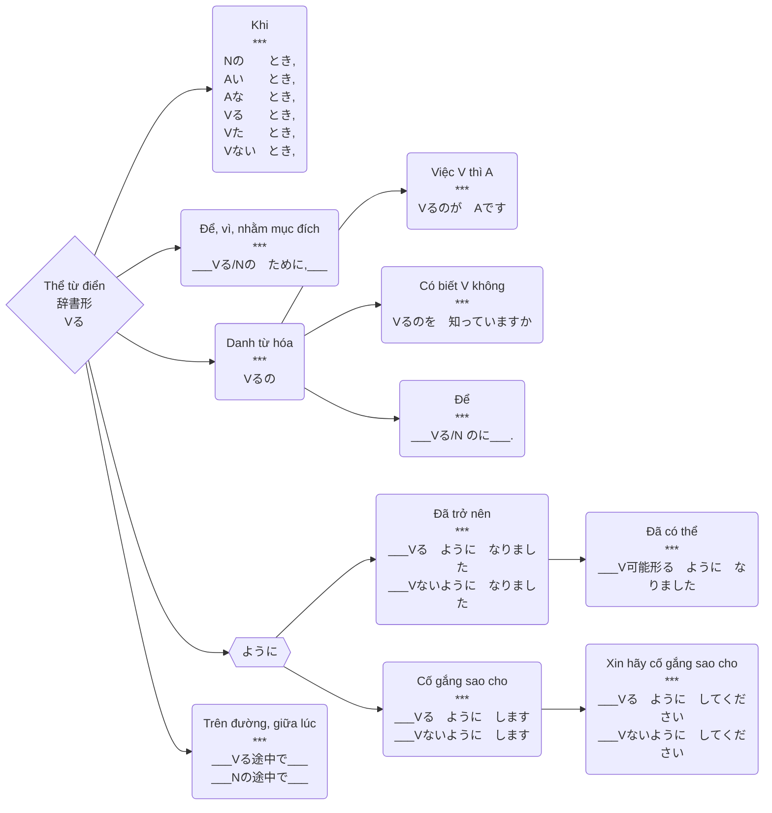

```mermaid
graph LR;
    V{Thể từ điển\n辞書形\nVる}

    V-->khi(Khi\n***\nNの　　とき,\nAい　　とき,\nAな　　とき,\nVる　　とき,\nVた　　とき,\nVない　とき,)
    V-->nhamMucDich(Để, vì, nhằm mục đích\n***\n___Vる/Nの　ために,___)
    V-->danhTuHoa(Danh từ hóa\n***\nVるの)

    danhTuHoa-->viecVthiAGa(Việc V thì A\n***\nVるのが　Aです)
    danhTuHoa-->coBietVKhong(Có biết V không\n***\nVるのを　知っていますか)
    danhTuHoa-->de(Để\n***\n___Vる/N のに___.)
    V-->youni{{ように}}
    youni-->daTroNen(Đã trở nên\n***\n___Vる　ように　なりました\n___Vないように　なりました)
    daTroNen-->daCoThe(Đã có thể\n***\n___V可能形る　ように　なりました)
    V-->trenDuongGiuaLuc(Trên đường, giữa lúc\n***\n___Vる途中で___\n___Nの途中で___)
    youni-->coGangSaoCho(Cố gắng sao cho\n***\n___Vる　ように　します\n___Vないように　します)
    coGangSaoCho-->xinHayCoGangSaoCho(Xin hãy cố gắng sao cho\n***\n___Vる　ように　してください\n___Vないように　してください)
```
