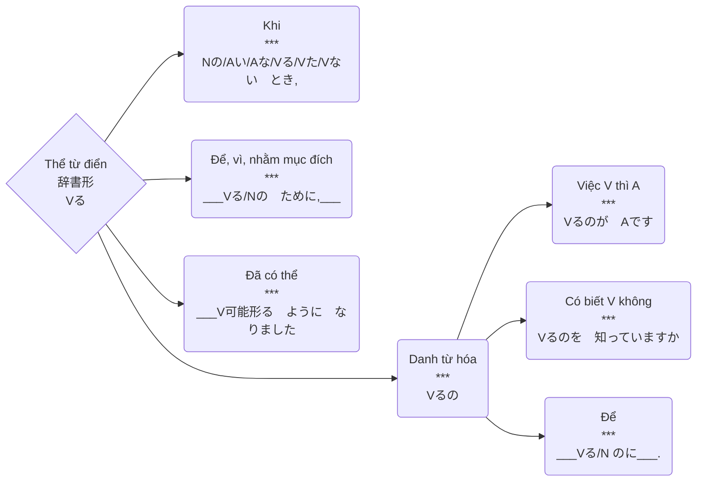

```mermaid
graph LR;
    V{Thể từ điển\n辞書形\nVる}

    V-->khi(Khi\n***\nNの/Aい/Aな/Vる/Vた/Vない　とき,)
    V-->nhamMucDich(Để, vì, nhằm mục đích\n***\n___Vる/Nの　ために,___)
    V-->daCoThe(Đã có thể\n***\n___V可能形る　ように　なりました)
    V--->danhTuHoa(Danh từ hóa\n***\nVるの)

    danhTuHoa-->viecVthiAGa(Việc V thì A\n***\nVるのが　Aです)
    danhTuHoa-->coBietVKhong(Có biết V không\n***\nVるのを　知っていますか)
    danhTuHoa-->de(Để\n***\n___Vる/N のに___.)

```
