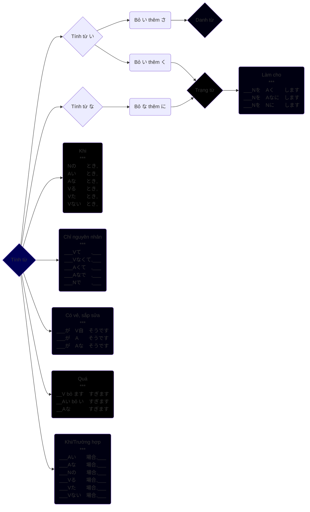

```mermaid
graph LR;
    A{Tính từ}

    A-->Ai{Tính từ い}
    A-->Ana{Tính từ な}

    Ai-->AiN(Bỏ い thêm さ)-->N{Danh từ}
    Ai-->AiA(Bỏ い thêm く)-->Adv{Trạng từ}
    Ana-->AnaA(Bỏ な thêm に)-->Adv{Trạng từ}
    A-->khi(Khi\n***\nNの　　とき,\nAい　　とき,\nAな　　とき,\nVる　　とき,\nVた　　とき,\nVない　とき,)
    A-->chiNguyenNhan(Chỉ nguyên nhân\n***\n___Vて　　,___\n___Vなくて,___\n___Aくて　,___\n___Aなで　,___\n___Nで　　,___)
    A-->coVeSapSua(Có vẻ, sắp sửa\n***\n___が　V自　そうです\n___が　A　　そうです\n___が　Aな　そうです)
    A-->qua(Quá\n***\n__V bỏ ます　すぎます\n__Aい bỏ い　すぎます\n__Aな 　　 　すぎます)
    Adv-->lamCho(Làm cho\n***\n___Nを　Aく　　します\n___Nを　Aなに　します\n___Nを　Nに　　します)
    A-->truongHop(Khi/Trường hợp\n***\n___Aい　　場合,___\n___Aな　　場合,___\n___Nの　　場合,___\n___Vる　　場合,___\n___Vた　　場合,___\n___Vない　場合,___)

    style A fill:#005
    style Adv fill:#000
    style chiNguyenNhan fill:#001
    style coVeSapSua fill:#000
    style coVeSapSua fill:#001
    style khi fill:#000
    style lamCho fill:#001
    style N fill:#001
    style qua fill:#000
    style truongHop fill:#001
```