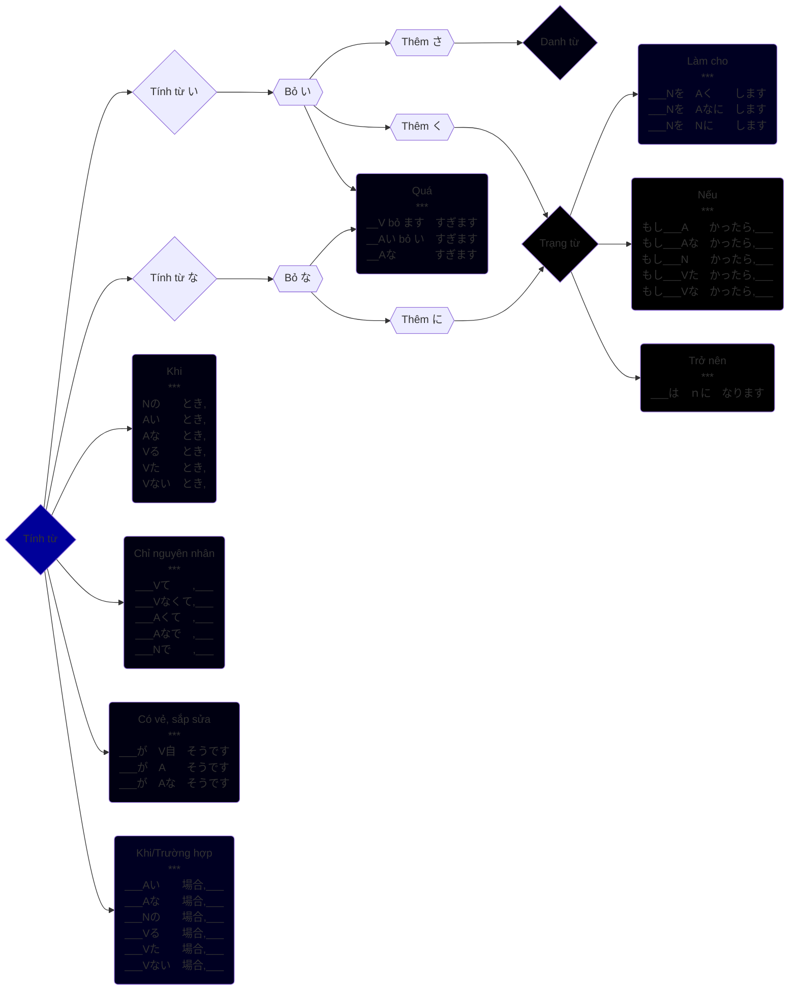

```mermaid
graph LR;
    A{Tính từ}

    A-->Ai{Tính từ い}
    A-->Ana{Tính từ な}

    Ai-->boI{{Bỏ い}}-->themSa{{Thêm さ}}-->N{Danh từ}
    boI-->themKu{{Thêm く}}-->Adv{Trạng từ}
    A-->khi(Khi\n***\nNの　　とき,\nAい　　とき,\nAな　　とき,\nVる　　とき,\nVた　　とき,\nVない　とき,)
    A-->chiNguyenNhan(Chỉ nguyên nhân\n***\n___Vて　　,___\n___Vなくて,___\n___Aくて　,___\n___Aなで　,___\n___Nで　　,___)
    A-->coVeSapSua(Có vẻ, sắp sửa\n***\n___が　V自　そうです\n___が　A　　そうです\n___が　Aな　そうです)
    boI-->qua(Quá\n***\n__V bỏ ます　すぎます\n__Aい bỏ い　すぎます\n__Aな 　　 　すぎます)
    Ana-->boNa{{Bỏ な}}
    boNa-->qua
    boNa-->themNi{{Thêm に}}-->Adv{Trạng từ}
    Adv-->lamCho(Làm cho\n***\n___Nを　Aく　　します\n___Nを　Aなに　します\n___Nを　Nに　　します)
    A-->truongHop(Khi/Trường hợp\n***\n___Aい　　場合,___\n___Aな　　場合,___\n___Nの　　場合,___\n___Vる　　場合,___\n___Vた　　場合,___\n___Vない　場合,___)
    Adv-->neu(Nếu\n***\nもし___A　　かったら,___\nもし___Aな　かったら,___\nもし___N　　かったら,___\nもし___Vた　かったら,___\nもし___Vな　かったら,___)
    Adv-->troNen(Trở nên\n***\n___は　ｎに　なります)

    style A fill:#009
    style Adv fill:#000
    style chiNguyenNhan fill:#001
    style coVeSapSua fill:#000
    style coVeSapSua fill:#001
    style khi fill:#001
    style lamCho fill:#002
    style N fill:#001
    style neu fill:#000
    style qua fill:#001
    style truongHop fill:#002
    style troNen fill:#000
```