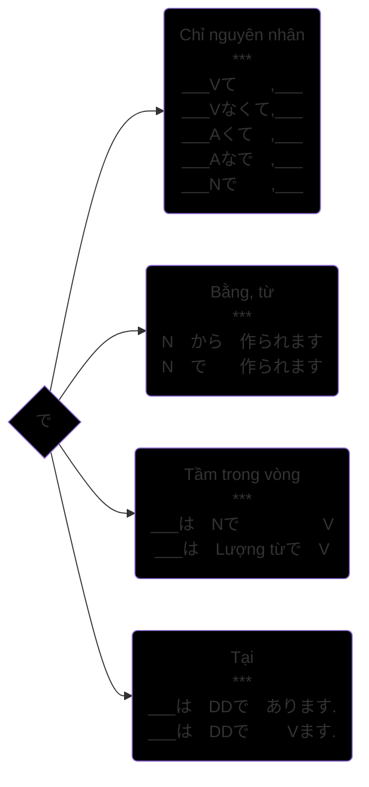

```mermaid
graph LR;
	tt{で}

	tt-->chiNguyenNhan(Chỉ nguyên nhân\n***\n___Vて　　,___\n___Vなくて,___\n___Aくて　,___\n___Aなで　,___\n___Nで　　,___)
	tt-->bangTu(Bằng, từ\n***\nN　から　作られます\nN　で　　作られます)
    tt-->tamTrongVong(Tầm trong vòng\n***\n___は　Nで　　　　　V\n___は　Lượng  từで　V)
    tt-->tai(Tại\n***\n___は　DDで　あります.\n___は　DDで　　 Vます.)
    
    style tt fill:#000
    style chiNguyenNhan fill:#000
    style bangTu fill:#000
    style tamTrongVong fill:#000
    style tai fill:#000
```