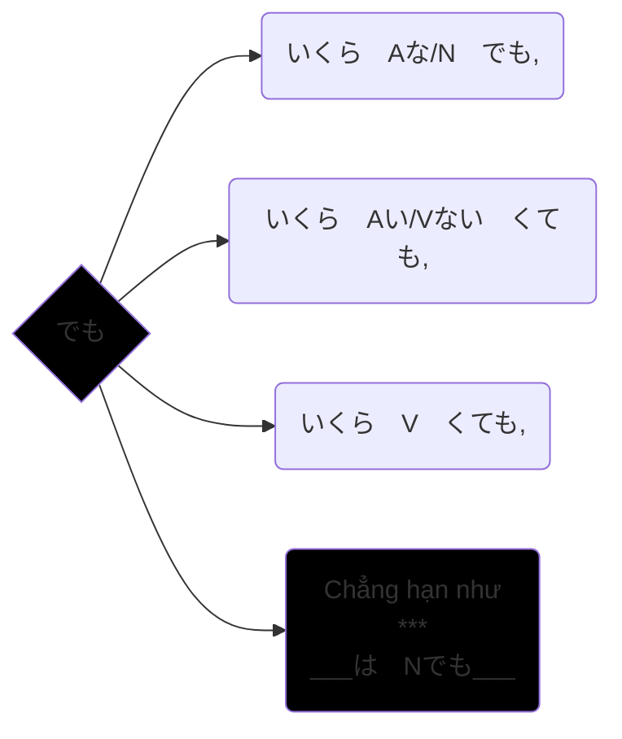

```mermaid
graph LR;
	tt{でも}

	tt-->choDu1(いくら　Aな/N　でも,)
	tt-->choDu2(いくら　Aい/Vない　くても,)
	tt-->choDu3(いくら　V　くても,)
	tt-->changHanNhu(Chẳng hạn như\n***\n___は　Nでも___)

	style tt fill:#000
	style changHanNhu fill:#000
```