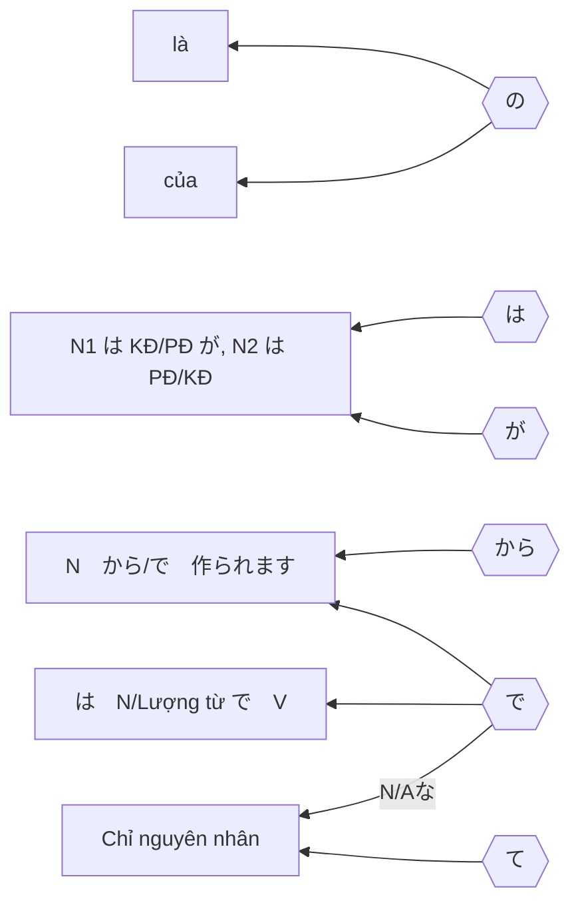

```mermaid
graph RL;
    no{{の}}
    ha{{は}}
    ga{{が}}
    kara{{から}}
    de{{で}}
    te{{て}}
    no-->là
    no-->của
    doiSanh[N1 は KĐ/PĐ が, N2 は PĐ/KĐ]
    ha-->doiSanh
    ga-->doiSanh
    kara-->tao[N　から/で　作られます]
    de-->tao
    de-->tamTrongVong[は　N/Lượng từ で　V]
    te-->nguyenNhan[Chỉ nguyên nhân]
    de-->|N/Aな|nguyenNhan
```