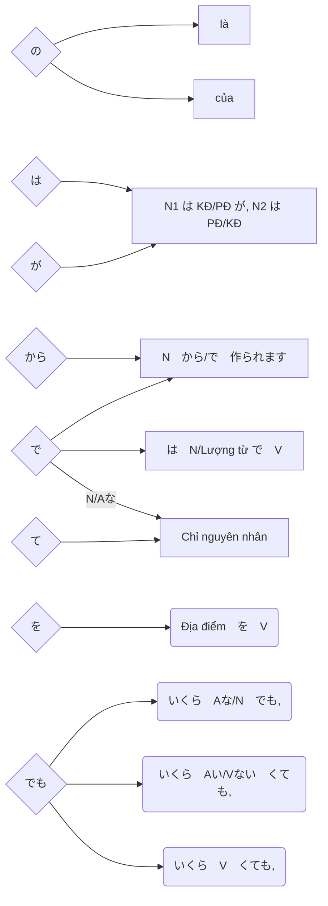

```mermaid
graph LR;
    no{の}
    ha{は}
    ga{が}
    kara{から}
    de{で}
    te{て}
    wo{を}
    demo{でも}
    no-->là
    no-->của
    doiSanh[N1 は KĐ/PĐ が, N2 は PĐ/KĐ]
    ha-->doiSanh
    ga-->doiSanh
    kara-->tao[N　から/で　作られます]
    de-->tao
    de-->tamTrongVong[は　N/Lượng từ で　V]
    te-->nguyenNhan[Chỉ nguyên nhân]
    de-->|N/Aな|nguyenNhan
	wo-->qua(Địa điểm　を　V)
	demo-->choDu1(いくら　Aな/N　でも,)
	demo-->choDu2(いくら　Aい/Vない　くても,)
	demo-->choDu3(いくら　V　くても,)
```